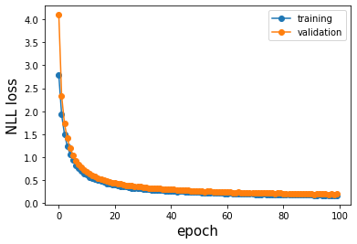

# Speech embeddings with Contrastive Predictive Coding


Python package to extract embeddings from natural speech through contrastive predictive coding. The method is based on the paper 
["Representation Learning with Contrastive Predictive Coding", van den Oord et al., 2019](https://arxiv.org/pdf/1807.03748v2.pdf). The embeddings can be used for analysis and downstream classification tasks invlving speech signals.

### Key intuition of CPC

The goal of CPC is to extract robust and generic representations of the data (a speech signal in this case) by capturing slow features, i.e. features that change slowly and that typically yeld more information about the latent structure of the data than local ones. For example, the emotion expressed by a speaker is more meaningfully represented by pitch and modulation that change on a scale of seconds rather than milliseconds.

In order to extract slow features we train a neural network in an unsupervised way to predict the future steps in a sequence from the previous ones under the assumption that past and future steps will be conditionally dependent on the same underlying information.The intuition is that the further in the future is the step to be predicted, the more the model will have to rely on an internal representation that captures the underlying long range dependencies and structre of the data. These can be temporal dependencies between slow intonation units in speech as well as spatial dependencies of colors and shapes in a picture.

A challenge of this approach is that predicting future steps  from the past context , e.g. learning the generative model  is expensine and often intractable because it requires the model to learn complex dependencies in the data that are not necessarily useful to model the relationship between  and . 

Instead of using a generative approach, CPC turns the problem into a classification task. This can be done by training the network to classify the next steps in an input sequence against a set of negative examples drawn randomly from the same distribution . The key intuition is that instead of optimizing  directly, we learn to maximize a quantity  that is a density ratio proportional to  and that maximally preserves the mutual information  between  and . For a formal demonstartion see original paper. 


Here are the main steps:

1. We build a batch  of size  containing 1 positive sample drawn from  and  negative samples drawn randomly from the distribution  for each time step . 

2. We obtain a context  by encoding the sequence until time . To do that we first encode  and pass it to an autoregressive unit  so that . The autoregressive model is used to keep track of all the past steps in the sequence.

3. We obtain the encoded representations   for each future step , such that 

4. For each time step  we obtain  by learning the linear mapping between  and  so that .

The network is trained end to end to otpimize infoNCE loss (see original paper). This will enforce  to learn the the density ratio propotional to 


### Architecture

Here we use the same architecture described in the original paper. This is composed by three main elements:

- The encoder  is composed by four blocks. Each of them is formed by a four 1D convolutional layer of size 512 and a batch normalization layer with ReLu activation.

- The autoregressive unit  is composed by one GRU block of size 256.

- The set of linear weights  is composed by  linear blocks of size 512.


### Dataset

The CPC architecture is trained on the Librispeech-100 (train-clean-100)
To get the dataset visit: http://www.openslr.org/12/

To prepare the dataset for training you can use the available preprocessing functions.

```python

file_list_path = path/to/train/split.txt
data_path = path/to/librispeech/dataset
data_path = path/to/save/output
seq_len = 20480

LibriSpeech100_preprocessing(file_list_path, data_path, train_output_path, seq_len)

```

This will create 3 separate .h5 files containing the preprocessed data for training, validation and test sets. These files can be directly passed to the dataloaders and the provided training methods. See below.


### Performance 

The model was trained until convergence using Adam optimizer in bathces of 8 samples (1 positive sample and 7 negative ones) on a Nvidia GTX 1080 TI GPU


Test loss: 0.2415

As proposed in the original paper, to test the use of the acquired latent representations we use the speech embeddings obtained through the CPC model to train a multi layer perceptron (MLP) on a speaker classification. Here we achieve the following performance:



Test loss: 0.1681
Test acc: 0.9575


### Usage

For a working version of the usage example see the following notebook: notebooks/xyz.ipynb

**extract speech embeddings**

```python
from cpcspeech import CPC_speech

X = # matrix containing a batch of audio vectors. size: (samples, 1, sequence_len)

model_path = 'path/to/trained/model'
cpc = CPC_speech()
cpc.load_pretrained_model(model_path)

speech_emb = cpc.transform(X)
```


**train the CPC model**

```python
from cpcspeech import CPC_speech

cpc = cpcspeech.CPC_speech()

train_path = 'path/to/processed/train_data.hdf5'
valid_path = 'path/to/processed/valid_data.hdf5'
cpc.load_train_data(train_path, valid_path)

cpc.train(100,plot=True)
```

**train a speaker classifier**

see notebooks/cpcspeech_usage_examples.ipynb


### Installation

The package can be installed as follows:

```
git clone https://github.com/giovannimaffei/contrastive_predictive_coding.git
cd contrastive_predictive_coding
make init
```

test installation:

```
python -c 'import cpcspeech'
```

### Resources

["Representation Learning with Contrastive Predictive Coding", van den Oord et al., 2019](https://arxiv.org/pdf/1807.03748v2.pdf)

[Journal club slides from Hugging Face](https://docs.google.com/presentation/d/1qxt7otjFI8iQSCpwzwTNei4_n4e4CIczC6nwy3jdiJY/edit#slide=id.p)

[Jefflai implementation](https://github.com/jefflai108/Contrastive-Predictive-Coding-PyTorch)

